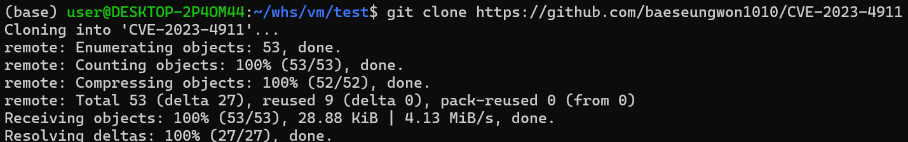
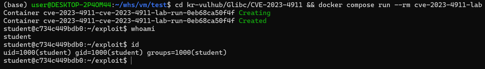
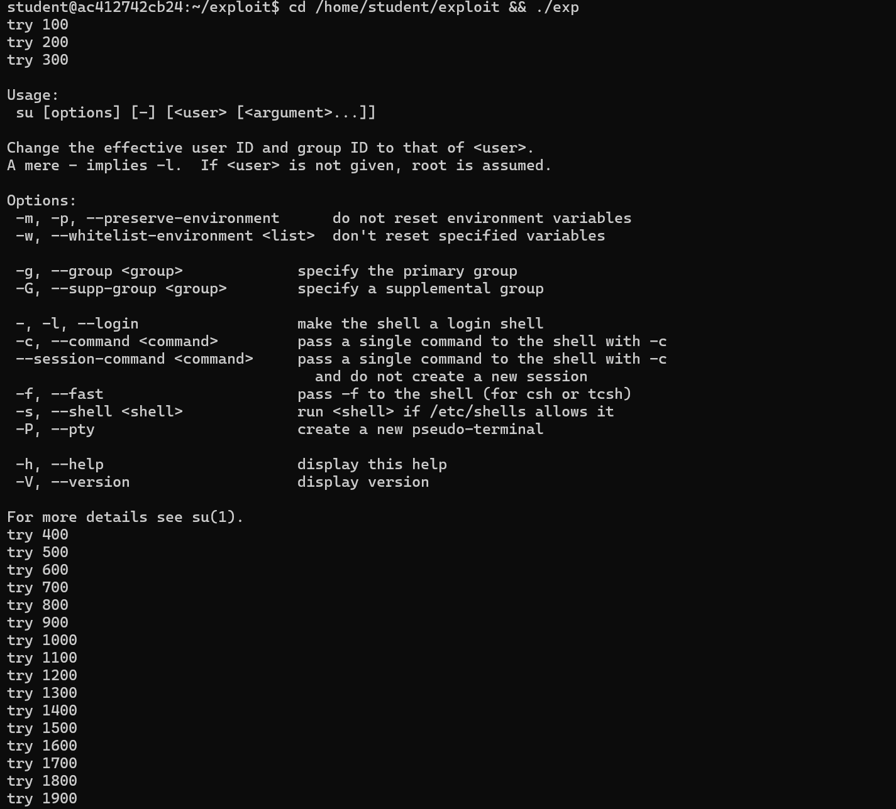
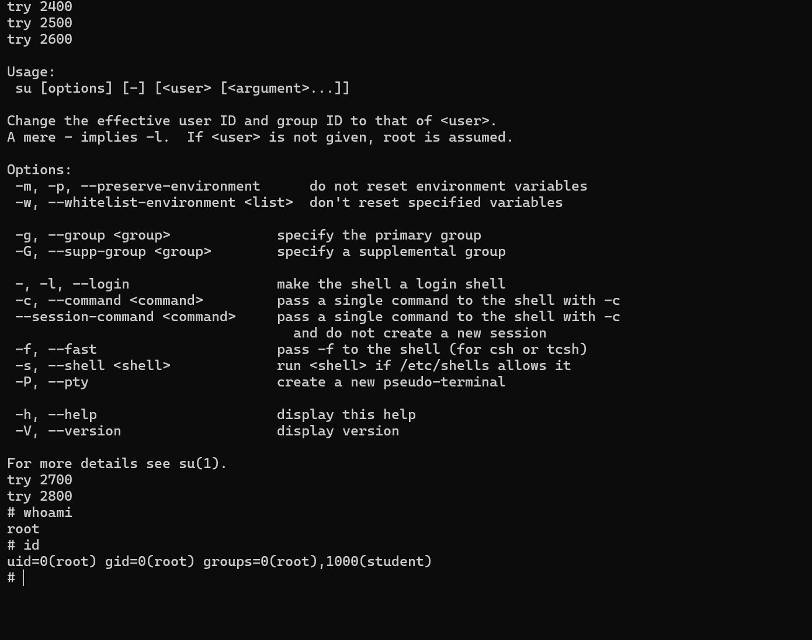

# glibc 힙 버퍼 오버플로우 취약점(CVE-2023-4911)

| 항목 | 내용 |
|---|---|
| CVE ID | CVE-2023-4911 |
| 공격 유형 | 힙 버퍼 오버플로우 → 로컬 권한상승(Local Privilege Escalation) |
| CVSS 3.1 | 7.8 (High) |
| 공개일 | 2023-10-03 |
| 취약 포인트 | glibc 동적 로더(`ld.so`)의 `GLIBC_TUNABLES` 파서 |
| 취약 버전 | glibc 2.34~2.38 |

## 1. 개요

CVE-2023-4911은 GNU C Library(glibc)의 동적 로더가 `GLIBC_TUNABLES` 환경변수를
파싱하는 과정에서 발생하는 힙 버퍼 오버플로우 취약점이다. 공격자는 이 오버플로우를
이용해 동적 로더의 라이브러리 검색 경로(`RPATH`)를 조작함으로써, SUID root
바이너리(`su`, `sudo` 등)가 실행될 때 공격자가 준비한 악성 공유 라이브러리를 대신
로드시켜 임의 코드를 root 권한으로 실행할 수 있다. glibc는 사실상 모든 주요
리눅스 배포판의 핵심 구성요소이므로, 이 취약점은 2021년 4월 이후 출시된 대부분의
glibc 기반 배포판에 영향을 미쳤다.

## 2. 취약 코드 일부

```c
while (true)
{
    char *name = p;
    size_t len = 0;

    /* 이름(name) 길이 찾기 */
    while (p[len] != '=' && p[len] != ':' && p[len] != '\0')
        len++;

    /* '=' 없이 끝나면 종료 */
    if (p[len] == '\0')
    {
        if (__libc_enable_secure)
            tunestr[off] = '\0';
        return;
    }

    /* ':'를 먼저 만나면 잘못된 항목 */
    if (p[len] == ':')
    {
        p += len + 1;
        continue;
    }

    /* '='를 만났으므로 value 시작으로 이동 */
    p += len + 1;

    /* 원본 문자열에서 value 계산 */
    char *value = &valstring[p - tunestr];

    len = 0;

    /* value 길이 찾기 */
    while (p[len] != ':' && p[len] != '\0')
        len++;

    ...
    /* tunestr에 복사 */
    ...

    if (p[len] != '\0')
        p += len + 1;
}
```

## 3. 원인 분석

### 3.1 정상 처리 흐름

1. `__tunables_init()`이 환경변수 목록에서 `GLIBC_TUNABLES`를 찾는다.
2. `tunables_strdup()`가 `__minimal_malloc()`으로 버퍼를 할당하고 원본 문자열을
   복사한다 (이 시점의 malloc은 아직 완전히 초기화되지 않은 매우 이른 malloc
   구현체다).
3. `parse_tunables()`가 이 버퍼를 `:`(콜론) 기준으로 순회하며 각
   `key=value` 쌍을 분리해 해당 튜너블에 값을 대입한다.

### 3.2 결함 지점

`parse_tunables()`는 하나의 튜너블을 **name 파싱 → `p` 이동 → value 파싱 → `p` 이동** 순서로 처리한다. 정상적인 입력에서는 value를 모두 처리한 뒤 다음 튜너블의 시작 위치로 `p`가 이동하여 다음 항목을 파싱한다.

그러나 다음과 같이 `name=name=value` 형태의 입력이 주어지면,

```text
GLIBC_TUNABLES=glibc.malloc.mxfast=glibc.malloc.mxfast=AAAA...(긴 문자열)
```

첫 번째 파싱 과정에서 `glibc.malloc.mxfast=AAAA...` 전체가 하나의 value로 인식되어 `tunestr` 버퍼에 복사된다. 이후 value 뒤에 다음 튜너블을 구분하는 콜론(`:`)이 존재하지 않아 파싱 포인터(`p`)가 다음 항목으로 이동하지 못하고, 이미 복사한 value의 시작 위치를 다시 가리키게 된다.

문제는 이 value 자체가 `name=value` 형태를 가지고 있다는 점이다. 다음 반복에서 파서는 이를 새로운 튜너블로 잘못 인식하여 중복된 데이터를 버퍼에 기록한다. `tunestr`은 원본 문자열 크기만큼만 할당되어 있으므로, 중복되어 기록되는 부분이 생겨 힙 버퍼 오버플로우가 발생한다.

### 3.3 오버플로우로 인한 효과

발생한 힙 버퍼 오버플로우는 `__minimal_malloc()`으로 연속 할당된 인접 힙 영역까지 덮어쓴다. 공격자는 이를 이용하여 동적 로더(ld.so)의 내부 구조체인 `link_map`의 `l_info[DT_RPATH]` 포인터를 공격자가 제어하는 스택 주소로 변경할 수 있다.

해당 스택 영역에는 미리 조작한 `Elf64_Dyn` 구조체가 배치되어 있으며, 이 구조체는 공격자가 원하는 디렉터리를 새로운 라이브러리 검색 경로(RPATH)로 지정한다. 그 결과 ld.so는 정상 시스템 라이브러리 대신 공격자가 준비한 공유 라이브러리를 우선적으로 로드하게 된다.

## 4. 공격 체인

1. 공격자는 `name=name=value` 형태의 `GLIBC_TUNABLES` 환경변수를 구성한다.
2. 일반 사용자 권한으로 SUID 프로그램(`su` 등)을 실행한다.
3. 커널은 SUID 비트에 의해 해당 프로세스의 **effective UID**를 root로 변경한 뒤 동적 로더(ld.so)를 실행한다.
4. ld.so의 `parse_tunables()`에서 힙 버퍼 오버플로우가 발생한다.
5. 오버플로우를 이용하여 `link_map`의 `l_info[DT_RPATH]` 포인터를 공격자가 준비한 가짜 `Elf64_Dyn` 구조체가 위치한 스택 주소로 조작한다.
6. ld.so는 조작된 RPATH 정보를 사용하여 공격자가 준비한 악성 `libc.so.6`을 로드한다.
7. 악성 `libc.so.6`의 초기화 코드(또는 변조된 시작 루틴)가 root 권한으로 실행되어 `setuid(0)`, `setgid(0)` 및 `/bin/sh` 실행을 수행한다.
8. 이 과정은 `su`의 인증 로직이 실행되기 전에 이루어지므로, 비밀번호 검증 없이 root 쉘을 획득하게 된다.

PoC는 난수화(ASLR)의 영향으로 원하는 메모리 레이아웃이 형성될 때까지 `execve()`를 반복 수행하는 브루트포스 방식을 사용한다. 따라서 공격 성공 여부 및 소요 시간은 환경에 따라 달라질 수 있으며, 일반적으로 수백~수천 회의 반복 시도가 필요하다.


## 5. 재현 조건

- SUID, SGID 등의 임의 권한 상승이 가능한 바이너리가 존재할 것
- 공격자가 해당 바이너리를 임의 환경변수와 함께 실행할 수 있을 것
- glibc이 패치 이전 버전일 것


## 6. 실습 환경 재현 (PoC)

우선 git에 있는 내용을 디렉토리에 clone 한다
```bash
git clone https://github.com/baeseungwon1010/CVE-2023-4911
```



아래 명령어를 통해 docker image를 빌드한다

```bash
cd C* && docker compose run --rm cve-2023-4911-lab
```



컨테이너 진입 후 expolit code를 실행한다

```bash
cd /home/student/exploit && ./exp
```

실행 후 기다리면 일반 user에서 sudo(0)으로 변한 것을 볼 수 있다




## 7. 대응 방안

glibc의 버전을 취약 버전에서 이상 버전으로 패치한다.
패치 후, 가능하면 재부팅/재시작으로 이전 버전의 glibc이 메모리에 남아있지 않게 한다
즉시 패치가 어려운 경우 불필요한 SUID, SGID 등의 프로세스를 삭제하는 임시방편이 존재한다.

## 8. 참고자료

- [NVD: CVE-2023-4911](https://nvd.nist.gov/vuln/detail/cve-2023-4911)
- [Ubuntu Security Notice: CVE-2023-4911](https://ubuntu.com/security/CVE-2023-4911)
- [leesh3288/CVE-2023-4911 PoC](https://github.com/leesh3288/CVE-2023-4911)
- [Debian Sources - glibc 2.28-10 `dl-tunables.c`](https://sources.debian.org/src/glibc/2.28-10/elf/dl-tunables.c)
